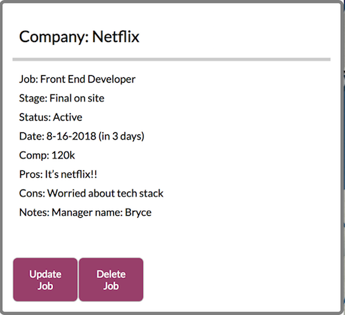

# MOBI
<h1>React Capstone: mobi</h1>

Live Link: <a href="https://mobi.netlify.com/"> mobi </a>

<h2>Images</h2>

Home Page 

Add Job 

Job 

<h2>Summary</h2>

Applying for jobs can be daunting. Sometimes in the thick of things, we forget when our next interview phone call will be or where we are in the interview stages. Mobi is an all-in-one job tracking system to help manage all of your prospective job opportunities throughout each step of the application process.

This project was bootstrapped with Create React App. Mobi's server side code (built with Node.js and MongoDB) can be found in this <a href="https://github.com/mikeramz86/project-dante"> repository </a>.

<h2> How to Use it</h2>

 Add Prospective Jobs: Includes position, company, salary, status, and other data to help you choose the right job for you. 

 Update: Update each input to help you keep better track of all your active job prospects.

 Delete: Delete Jobs that are no longer a priority. (Update: Archived feature coming soon!)

 Comments: Adding comments will help you better prepare for the next stages or remind you of important things in your interviews.

<h2> Technology Used</h2>
<h3>Front End</h3>
<li>React.js</li>
<li> Redux</li>
<li> CSS3 </li>
<li>Testing with [Enzyme]<a href="http://airbnb.io/enzyme/docs/api/"></li>
<li>Javascript</li>

<h3>Back End</h3>
<li>Node.js</li>
<li>Express.js</li>
<li>MongoDB</li>
<li>Mongoose</li>
<li>mLab database</li>
<li>Mocha and Chai for testing</li>
<li> JSON Web Tokens (user authentication) </li>

<h2>Responsive</h2>

This app is built to be focused on mobile first design and is able to function in different view ports.

<h2>Next Version/Updates</h2>
<li>Stage Components: Being able to select stages to see where each job is in what state of interview.</li>
<li>Connecting to Email and Calendar apps: Get notifications when your next interview is.</li>
<li>Job List: Connecting to Job apps.</li>
